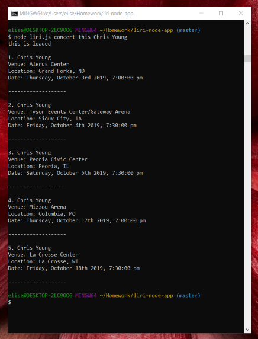
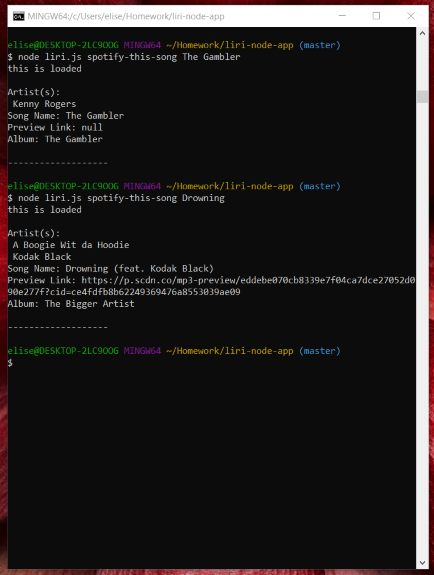
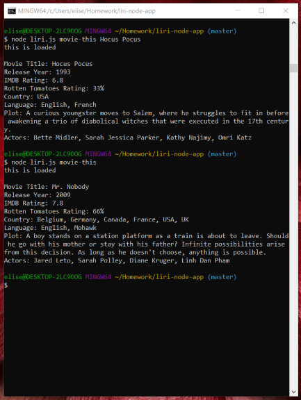
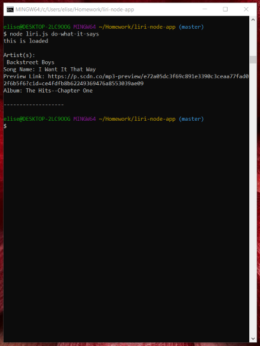

# liri-node-app
> This is a command line node app that takes in parameters and gives you back data.

## Table of contents
* [General info](#general-info)
* [Screenshots](#screenshots)
* [Technologies](#technologies)
* [Setup](#setup)
* [Features](#features)
* [Status](#status)
* [Inspiration](#inspiration)
* [Contact](#contact)

## General info
Using Bandsintown, Spotify and OMBD, the user can chose from four options:
* node liri.js concert-this "artist"
* node liri.js spotify-this-song "song"
* node liri.js movie-this "movie"
* node liri.js do-what-it-says
* Choices must be input with something in place of the quotes
     (ex: node liri.js movie-this Independence Day)

## Screenshots

## Technologies
* Bands in Town Artist Events API
* Spotify API
* OMDB API
* JavaScript
* Nodejs

## Setup
npm install axios, fs, moment and node-spotify-api  
A Spotify ID and Secret will be needed.

## Code Examples
    switch(command) {
        case "concert-this":
            concert();
            break;
        case "spotify-this-song":
            song();
            break;
        case "movie-this":
            movie();
            break;
        case "do-what-it-says":
            random();
            break;
        default:
            console.log("Instructions");
            break;
    };

## Features
List of features ready and TODOs for future development
* concert-this 'artist/band name' will return a list of 5 upcoming concerts with venue, location and date.
* spotify-this-song 'song name' will return the artist(s), song name, a preview link from Spotify and the album the song is from.
* movie-this 'movie name' will return the movie title, year released, IMDB and Rotten Tomatoes ratings, the country where the movie was produced, the language of the movie, plot and actors in the movie
* do-what-it-says will use fs to return the command and choice from a separate text file.

## Status
Project is: _finished_

## Inspiration
Based on a homework assignment for The Coding Bootcamp at UT Austin

## Contact
Created by Elise Hammons - feel free to contact me!
 LinkedIn: https://www.linkedin.com/in/elise-h-01243258/